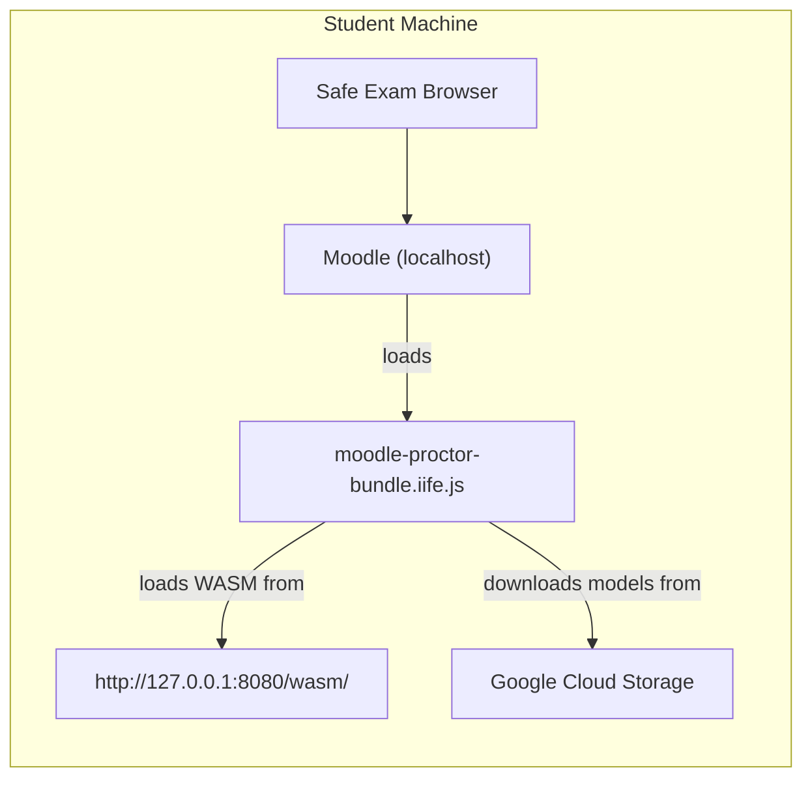
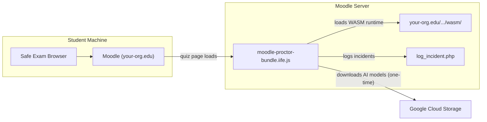

# Timadey AI Proctoring — Production Deployment Guide

## Current Architecture (Local)



**What needs to change:** The `127.0.0.1:8080` http-server goes away. Everything must be served from your organisation's Moodle server.

---

## Production Architecture



---

## What You Need to Deploy

### Files to Upload to Moodle Server

| File | Size | Purpose |
|------|------|---------|
| `moodle-proctor-bundle.iife.js` | ~193 KB | The proctoring engine + bridge (single file) |
| `moodle-proctor-bundle.css` | ~1.8 KB | Widget styling |
| `wasm/vision_wasm_internal.js` | ~324 KB | MediaPipe WASM loader |
| `wasm/vision_wasm_internal.wasm` | ~11.5 MB | MediaPipe WASM binary |

---

## Step 1: Moodle Admin Setup

### 1A. Upload the Proctoring Files

Choose **one** of these approaches:

#### Option A: Moodle Local Plugin (Recommended)
Create a simple Moodle plugin at `/local/timadey/` on your Moodle server:

```
/var/www/html/moodle/local/timadey/
├── version.php                          # Plugin metadata
├── lib.php                              # Hook to inject JS
├── log_incident.php                     # API endpoint for incident logging
├── assets/
│   ├── moodle-proctor-bundle.iife.js    # The bundle
│   ├── moodle-proctor-bundle.css        # Styles
│   └── wasm/
│       ├── vision_wasm_internal.js      # MediaPipe WASM loader
│       └── vision_wasm_internal.wasm    # MediaPipe WASM binary
└── db/
    └── install.xml                      # (optional) DB table for incidents
```

**`version.php`:**
```php
<?php
defined('MOODLE_INTERNAL') || die();
$plugin->component = 'local_timadey';
$plugin->version = 2026042800;
$plugin->requires = 2022041900; // Moodle 4.0+
```

**`lib.php`** — Inject the proctoring script into quiz pages:
```php
<?php
defined('MOODLE_INTERNAL') || die();

function local_timadey_before_standard_html_head() {
    global $PAGE;

    // Only inject on quiz attempt pages
    if (strpos($PAGE->url->get_path(), '/mod/quiz/attempt.php') !== false) {
        $PAGE->requires->css(new moodle_url('/local/timadey/assets/moodle-proctor-bundle.css'));
        $PAGE->requires->js(new moodle_url('/local/timadey/assets/moodle-proctor-bundle.iife.js'), true);
    }
}
```

**`log_incident.php`** — Receive proctoring events:
```php
<?php
require_once('../../config.php');
require_login();

$data = json_decode(file_get_contents('php://input'), true);
if (!$data) {
    http_response_code(400);
    die('Invalid data');
}

// Log to Moodle's standard log
$event = \core\event\user_updated::create([
    'context' => context_system::instance(),
    'other' => [
        'message' => $data['message'] ?? 'Unknown',
        'severity' => $data['severity'] ?? 0,
    ],
]);
$event->trigger();

// Or insert into a custom DB table (better for reporting)
// $DB->insert_record('local_timadey_incidents', (object)[
//     'userid' => $USER->id,
//     'quizid' => $data['quizid'] ?? 0,
//     'message' => $data['message'],
//     'severity' => $data['severity'],
//     'timecreated' => time(),
// ]);

echo json_encode(['status' => 'ok']);
```

#### Option B: Quick & Dirty (No Plugin)
If you just want to test quickly on the org Moodle:
1. Upload the files to Moodle's web root: `/var/www/html/moodle/timadey/`
2. Add the script via **Site Administration → Appearance → Additional HTML** (in `<head>`):
```html
<script>
if (window.location.pathname.includes('/mod/quiz/attempt.php')) {
    var link = document.createElement('link');
    link.rel = 'stylesheet';
    link.href = '/timadey/moodle-proctor-bundle.css';
    document.head.appendChild(link);

    var script = document.createElement('script');
    script.src = '/timadey/moodle-proctor-bundle.iife.js';
    document.body.appendChild(script);
}
</script>
```

### 1B. Update the WASM Path in the Engine

> [!IMPORTANT]
> The `@timadey/proctor` ESM build has the WASM path **hardcoded** to `http://127.0.0.1:8080/wasm`. You MUST change this before deploying.

Edit `node_modules/@timadey/proctor/dist/index.esm.js` and change:
```diff
- r.sharedModels.vision=await t.forVisionTasks("http://127.0.0.1:8080/wasm")
+ r.sharedModels.vision=await t.forVisionTasks("/local/timadey/assets/wasm")
```

Then rebuild:
```bash
npm run build
```

> [!TIP]
> The path should be **relative to your Moodle domain root**, e.g.:
> - Plugin approach: `/local/timadey/assets/wasm`
> - Quick approach: `/timadey/wasm`

### 1C. Update the Incident Logging Endpoint

In `moodle-bridge.js`, the API endpoint is already set:
```javascript
this.moodleApiEndpoint = '/local/timadey/log_incident.php';
```

Uncomment the `fetch` call in the `logIncident()` method and add the user/quiz context:
```javascript
async logIncident(message, severity) {
    console.warn(`[Timadey Bridge Incident] ${message} (Severity: ${severity})`);
    try {
        await fetch(this.moodleApiEndpoint, {
            method: 'POST',
            headers: { 'Content-Type': 'application/json' },
            body: JSON.stringify({
                message,
                severity,
                timestamp: Date.now(),
                // Pull from Moodle's global config
                userid: window.M?.cfg?.userid || 0,
                sesskey: window.M?.cfg?.sesskey || '',
            })
        });
    } catch (err) {
        console.error('[Timadey Bridge] Failed to log incident to Moodle', err);
    }
}
```

### 1D. Configure Quiz Settings

For each quiz that needs proctoring:

1. Go to **Quiz → Settings → Extra restrictions on attempts**
2. Enable **"Require Safe Exam Browser"** (if using SEB)
3. Upload the `.seb` config file or paste the Browser Exam Key
4. Set **"Require network connection"** to Yes (for model downloads)

---

## Step 2: Update SEB Configuration

Update [TimadeyExam.seb](file:///c:/Users/msacc/Downloads/MayProct/TimadeyExam.seb) for production:

### Changes Required:

```diff
  <key>startURL</key>
- <string>http://localhost/login/index.php</string>
+ <string>https://moodle.your-org.edu/login/index.php</string>
```

### Network Filtering (if enabled):
If you enable URL filtering, whitelist these domains:
- `moodle.your-org.edu` — Your Moodle server
- `storage.googleapis.com` — MediaPipe AI model downloads (first load only)

> [!WARNING]
> The AI models (~15 MB total) are downloaded from Google Cloud Storage on first load and cached in IndexedDB. Students need internet access for the first exam. After that, models are cached locally.

---

## Step 3: Student Setup

### What Students Need:
1. **Safe Exam Browser** installed — Download from [safeexambrowser.org](https://safeexambrowser.org)
2. **Working webcam and microphone**
3. **Internet access** (at least for the first exam, to download AI models)

### Student Instructions (share via email/LMS):

> **Before Your Exam:**
> 1. Install **Safe Exam Browser (SEB)** from your IT department or [safeexambrowser.org](https://safeexambrowser.org)
> 2. Download the `.seb` configuration file provided by your instructor
> 3. Ensure your **webcam and microphone** are working
> 4. Close all other applications
>
> **Starting the Exam:**
> 1. Double-click the `.seb` file — SEB will open automatically
> 2. Log into Moodle with your credentials
> 3. Navigate to the quiz and click "Attempt quiz"
> 4. **Allow camera and microphone access** when prompted (required!)
> 5. You'll see a small webcam widget in the bottom-right corner — this is the AI proctor
> 6. The widget border will be:
>    - 🟢 **Green** = All good
>    - 🟡 **Orange** = Minor concerns detected
>    - 🔴 **Red** = Significant concerns
>
> **During the Exam:**
> - Keep your face visible to the camera at all times
> - Do not talk or whisper
> - Do not use your phone
> - Do not look away from the screen for extended periods
> - Do not cover your face or camera

---

## Step 4: Production Hardening

### 4A. Remove Debug UI
Before deploying, remove the on-screen debug log and diagnostics:

In `moodle-bridge.js`:
- Remove or comment out `this.startDiagnostics()` call
- Remove or hide the debug log element (or set it to `display: none` in CSS)
- Consider keeping `console.log` statements for server-side log collection

### 4B. Persist the GPU Delegate Fix

> [!CAUTION]
> The `delegate: "GPU"` patch in `node_modules` will be lost on `npm install`. Use one of these approaches:

**Option 1: `patch-package` (Recommended)**
```bash
npx patch-package @timadey/proctor
```
This creates a `patches/` directory. Add a `postinstall` script to `package.json`:
```json
{
  "scripts": {
    "postinstall": "npx patch-package"
  }
}
```

**Option 2: Manual postinstall script**
Add to `package.json`:
```json
{
  "scripts": {
    "postinstall": "node -e \"const f='node_modules/@timadey/proctor/dist/index.esm.js';const fs=require('fs');fs.writeFileSync(f,fs.readFileSync(f,'utf8').replace(/delegate:\\\"CPU\\\"/g,'delegate:\\\"GPU\\\"'))\""
  }
}
```

### 4C. HTTPS Requirement

> [!IMPORTANT]
> `getUserMedia` (camera/mic access) requires HTTPS in production browsers. Your Moodle server **must** use HTTPS.

### 4D. Content Security Policy
If your Moodle has a strict CSP, add these:
```
script-src 'self' blob:;
connect-src 'self' https://storage.googleapis.com;
worker-src 'self' blob:;
```

---

## Complete Deployment Checklist

| # | Task | Who | Status |
|---|------|-----|--------|
| 1 | Update WASM path from `127.0.0.1:8080` to production URL | Developer | ☐ |
| 2 | Change delegate `CPU` → `GPU` and persist with patch-package | Developer | ☐ |
| 3 | Uncomment incident logging in `logIncident()` | Developer | ☐ |
| 4 | Remove debug UI / diagnostics | Developer | ☐ |
| 5 | Run `npm run build` for final production bundle | Developer | ☐ |
| 6 | Upload files to Moodle server (`/local/timadey/`) | Admin | ☐ |
| 7 | Install Moodle plugin or add Additional HTML injection | Admin | ☐ |
| 8 | Create `log_incident.php` endpoint | Admin | ☐ |
| 9 | Ensure Moodle is on HTTPS | Admin | ☐ |
| 10 | Update CSP headers if needed | Admin | ☐ |
| 11 | Update `.seb` file `startURL` to production Moodle URL | Admin | ☐ |
| 12 | Configure quiz to require SEB | Admin | ☐ |
| 13 | Test with SEB on a staging quiz | Admin | ☐ |
| 14 | Distribute `.seb` file to students | Admin | ☐ |
| 15 | Students install SEB | Student | ☐ |
| 16 | Students test camera/mic before exam day | Student | ☐ |

---

## Fixes Applied During Development

| Issue | Root Cause | Fix |
|-------|-----------|-----|
| "No face / Person left" spam | Patched `vision_wasm_internal.js` corrupted MediaPipe runtime | Replaced with clean WASM from `@mediapipe/tasks-vision@0.10.34` |
| Face detection never works | ESM build uses `delegate:"CPU"` (broken in IIFE bundle) | Patched to `delegate:"GPU"` matching standalone build |
| Diagnostic interference | `setInterval` calling `detectForVideo` with colliding timestamps | Removed direct `detectForVideo` call from diagnostics |
| SEB OffscreenCanvas crash | SEB lacks OffscreenCanvas support | Conditional Emscripten GL context pre-creation |
